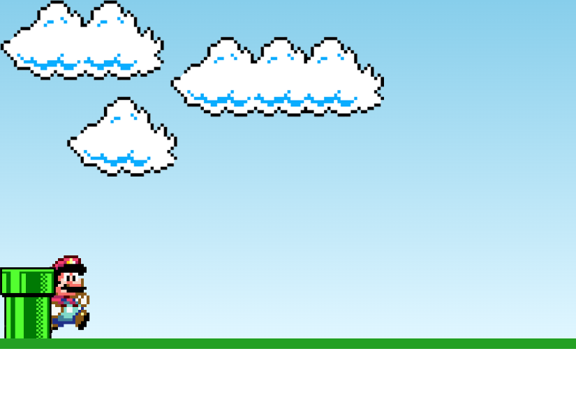

<h1 align="center"> Mario game </h1>

Mario game criado utilizando HTML, CSS e JavaScript, com base nos ensinamentos do [vídeo - Como criar um jogo SIMPLES usando JavaScript e HTML | JavaScript para iniciantes - Tutorial](https://youtu.be/r9buAwVBDhA) do canal [@ManualdoDev](https://www.youtube.com/@ManualdoDev) no Youtube. 

  <a href="#-tecnologias">Tecnologias</a>&nbsp;&nbsp;&nbsp;|&nbsp;&nbsp;&nbsp;
  <a href="#-projeto">Projeto</a>&nbsp;&nbsp;&nbsp;|&nbsp;&nbsp;&nbsp;
  <a href="#-layout">Layout</a>&nbsp;&nbsp;&nbsp;|&nbsp;&nbsp;&nbsp;
  <a href="#memo-licença">Licença</a>

 

  

## 🚀 Tecnologias

Esse projeto foi desenvolvido com as seguintes tecnologias:

- HTML 
- CSS
- JavaScript

## 💻 Projeto

O Mario game é um jogo que utiliza o personagem Mario, criado pela Nintendo e muito famoso no mundo dos games. Neste jogo é possível saltar os conhecidos encamentos verdes, que no jogo original o Mario os utiliza para se deslocar de uma área para outra, entretanto, neste jogo se você colide neste obstáculo o jogo é finalizado.

## 🔖 Layout

Você pode navegar pelo projeto através [DESSE LINK](https://thiagomonts.github.io/mario/).

## :memo: Licença

Esse projeto está sob a licença MIT.

---

Desenvolvido por [Thiago Honorato](https://www.linkedin.com/in/honoratothiago/)
